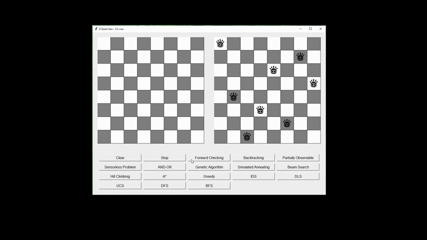
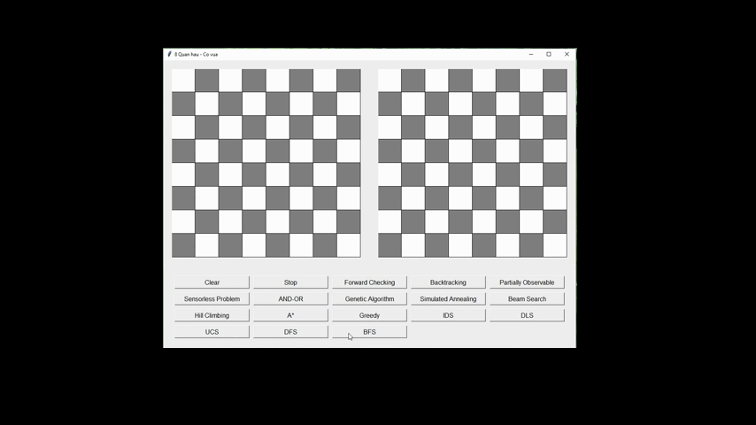
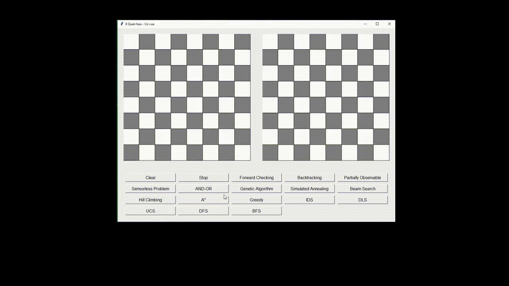
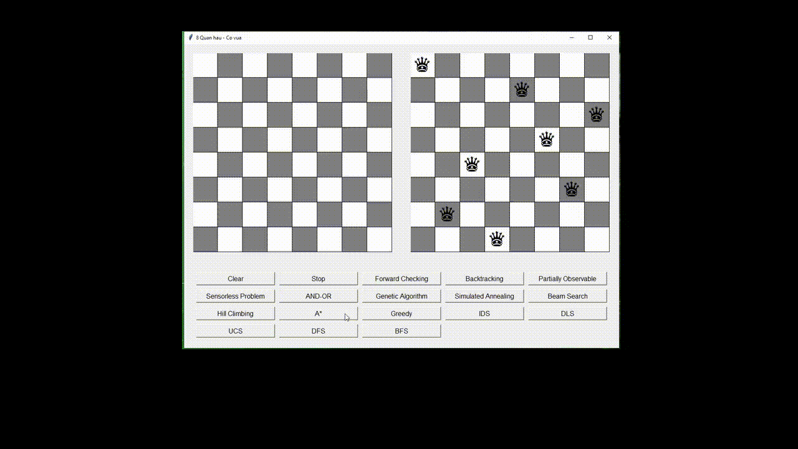
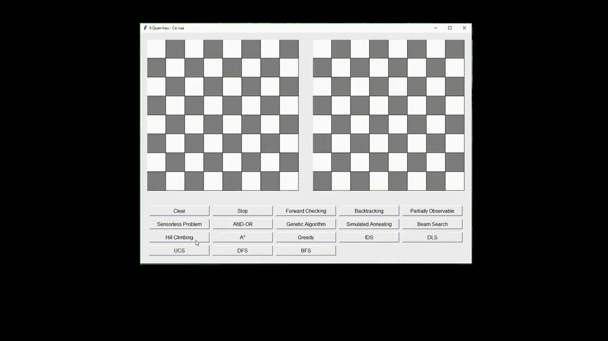
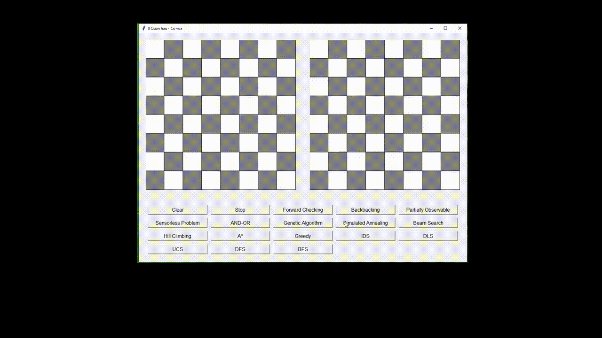
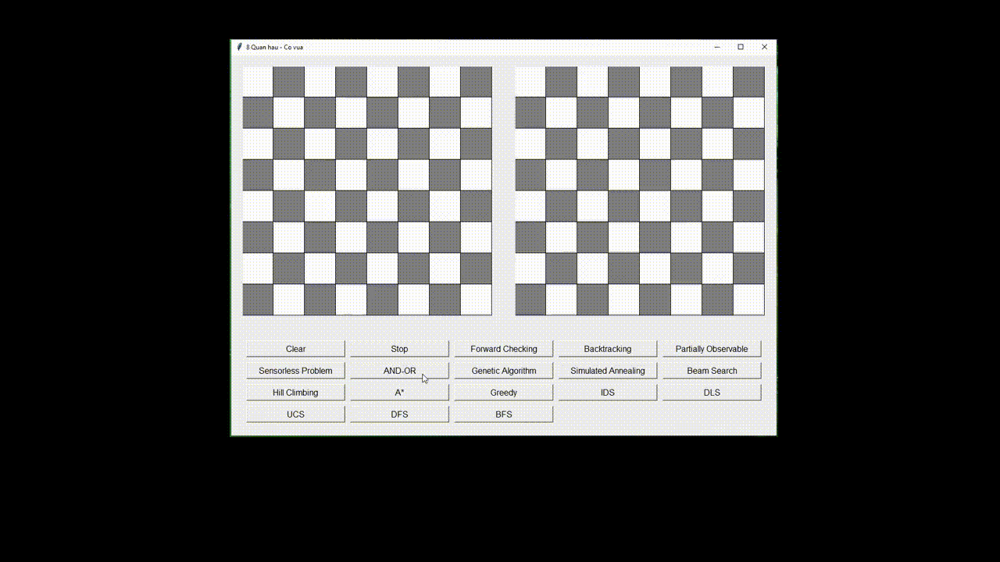
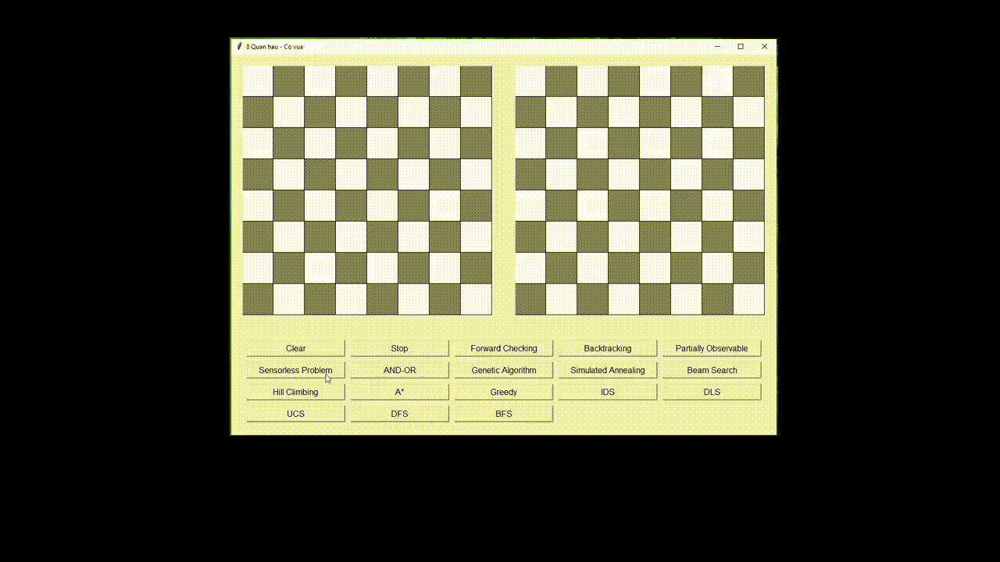
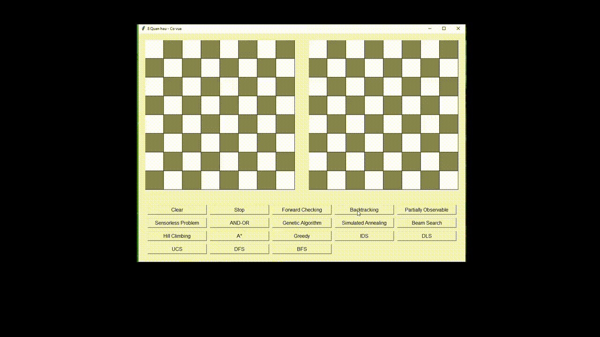

Bài tập cá nhân môn AI - Nguyễn Văn Hoài - 20110107

**Hướng dẫn: Vào thư mục "BT_ca_nhan", sau đó chạy file "UI_8_quan_hau.py"

# Demo DFS

---------------------------------------------------

# Demo BFS

---------------------------------------------------

# Demo Greedy

---------------------------------------------------

# Demo A*

---------------------------------------------------

# Demo Hill Climbing

---------------------------------------------------

# Demo Simulated Annealing

---------------------------------------------------

# Demo AND_OR

---------------------------------------------------

# Demo Sensorless Problem

---------------------------------------------------

# Demo Backtracking

---------------------------------------------------

# Demo Forward Checking

---------------------------------------------------
